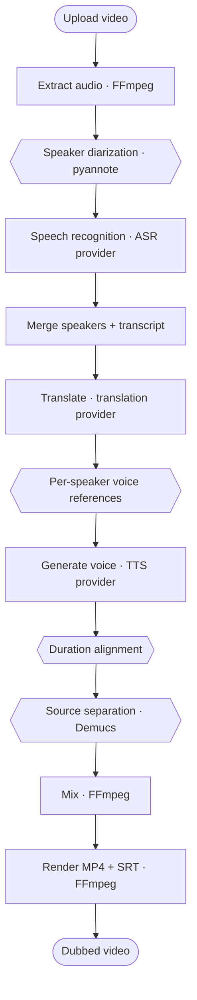

# DubFlow — Multilingual Video Dubbing

A model-agnostic video dubbing pipeline. Speech recognition, translation, speech
generation, speaker diarization and source separation are each a
**provider** behind a capability, so any of them can be swapped from the web UI
or the n8n form without changing the pipeline. Inference can run in a local
Docker service or on a Google Colab GPU. Model weights are loaded lazily and
cached outside the container image.

| | |
|---|---|
| **Stack** | FastAPI · n8n · FFmpeg · Docker Compose · optional Google Colab |
| **Models** | 16 ASR · 3 translation · 2 TTS · 1 diarization · 2 separation |
| **Languages** | 50 (ISO-639-1), coverage declared per model |
| **Tests** | 141, no GPU and no model download required |
| **Status** | Reference implementation. Demo-grade security — see [Limitations](#limitations) |

---

## Contents

- [Overview](#overview)
- [Getting started](#getting-started)
- [Architecture](#architecture)
- [Models](#models)
- [Configuration](#configuration)
- [API reference](#api-reference)
- [Development](#development)
- [Troubleshooting](#troubleshooting)
- [Limitations](#limitations)
- [Future work](#future-work)
- [Licensing and attribution](#licensing-and-attribution)

---

## Overview

Upload a video, choose a target language and a set of models, and receive an
MP4 with a synchronised voice-over and embedded subtitles.



Hexagons are optional stages. When a job switches one off it reports itself as
skipped and the pipeline continues, so one graph serves every configuration.

**Three design rules** hold the project together:

1. **The pipeline never names a model.** Stages depend on `ASRProvider`,
   `TTSProvider` and friends, never on Whisper or F5.
2. **One catalogue.** `GET /capabilities` is the only list of models; the UI and
   the local API read it rather than keeping copies.
3. **Nothing is claimed that was not checked.** A model appears under a language
   only if its own card or source says so, and its licence is recorded with it.

---

## Getting started

### Prerequisites

| Requirement | Notes |
|---|---|
| Docker Desktop, running | Supplies n8n, FFmpeg and the optional local model service |
| `python3` ≥ 3.9 on the host | Only for `make check` and the tests |
| One inference option | Local CPU, local NVIDIA GPU, or a Google Colab GPU session |

### Option A: run everything locally

CPU mode works on Docker Desktop, including Apple Silicon:

```bash
make local
```

On Linux or Windows with NVIDIA Container Toolkit and a supported NVIDIA GPU:

```bash
make local-gpu
```

| Service | URL |
|---|---|
| Web UI | <http://localhost:8000> |
| Local AI API | <http://localhost:8001/docs> |
| n8n workflow | <http://localhost:5678> |

The image installs PyTorch, faster-whisper, Transformers and the base model
providers. The first job downloads the selected weights into the
`local-model-cache` Docker volume; later containers reuse them. The default
Whisper small, NLLB-200 600M and MMS-TTS path runs without optional packages.
On CPU, start with a 10-second clip and expect model loading and inference to be
much slower than on a GPU.

Local mode deliberately keeps optional engines out of the base image. The UI
reports F5-TTS, pyannote and Demucs as unavailable until their packages and any
required credentials are added. The standard local path still completes a dub
with one stock voice, duration alignment and voice-over mixing.

Useful local commands:

```bash
make local-logs          # local-ai + API + n8n
make local-restart       # CPU mode after code/config changes
make local-gpu-restart   # the same while retaining NVIDIA GPU access
make local-stop          # keeps jobs and downloaded model weights
```

### Option B: run inference on Colab

#### 1. Start the AI service on Colab

1. Open [`colab/ai_service.ipynb`](colab/ai_service.ipynb) in Google Colab and
   select a GPU runtime.
2. In the first cell, enable only the engines you intend to use — see
   [Dependency conflicts](#dependency-conflicts) — and paste a Hugging Face
   token into `HF_TOKEN` if you want speaker diarization.
3. Run all cells. The last one prints a ready-to-run command.

The launch cell stops the previous server and reloads the checkout, so `Run all`
is enough after pulling new code. A session started by an older copy of the
notebook holds a server that cannot be stopped from the notebook — use
**Runtime → Restart session** first.

#### 2. Point the local stack at that session

```bash
make colab URL=https://your-tunnel.trycloudflare.com TOKEN=your-token
```

This writes `.env`, restarts the API and reports which backends are live. The
tunnel URL changes every time the Colab session restarts.

#### 3. Start the stack

```bash
make start
```

| Service | URL |
|---|---|
| Web UI | <http://localhost:8000> |
| API documentation | <http://localhost:8000/docs> |
| n8n workflow | <http://localhost:5678> |

Upload a short clip — ten to twenty seconds is enough for a first run — and
watch the ten stages execute.

---

## Architecture

### Layers

Three layers, and nothing reaches across them:

| Layer | Location | Responsibility |
|---|---|---|
| HTTP API | `colab/server.py`, `ai-service/app.py` | Requests, authentication, files |
| Pipeline | `colab/pipeline/` | Stage order and job state |
| Providers | `colab/providers/<task>/` | One model family each |

- **`dubflow_core/`** is pure standard library and is imported by both
  services: the language table, the canonical segment schema, the alignment
  arithmetic and the audio filter graphs. It is why the two implementations of
  the pipeline cannot disagree about what a segment is or how a mix is built.
- **`colab/providers/<task>/registry.py`** holds metadata only — no torch, no
  transformers — so `GET /capabilities` answers correctly in a session where
  nothing optional is installed, reporting each engine as `available: false`
  rather than failing to start.
- **`colab/providers/<task>/<name>.py`** is imported the first time a model is
  actually run.

### Repository layout

```text
dubflow_core/            Shared, dependency-free: languages, segments,
                         alignment, mixing
colab/                   AI service (runs on the Colab GPU)
  ai_service.ipynb       Notebook: install flags, launch, tunnel
  server.py              HTTP layer only
  jobs.py                Job store and single-worker queue
  core/                  Errors, runtime (device, model slots), media, config
  providers/
    base.py              ModelSpec and Registry
    asr/                 faster_whisper, seamless, mms
    translation/         nllb, seamless
    tts/                 mms, edge
    diarization/         pyannote
    separation/          demucs
  pipeline/              The ten stages and the runner
ai-service/              Local FastAPI service: storage, FFmpeg, orchestration
local-ai-service/        Docker image for running the Colab API locally
frontend/index.html      Single-file web UI, reads /capabilities
n8n/workflows/           The visual pipeline
scripts/                 check_contract.py, set_backend.py
tests/                   136 tests, no GPU required
```

### Pipeline stages

On the n8n route the FFmpeg stages run in `ai-service`. Model calls go to the
selected AI backend over HTTP. With `make local` that traffic stays inside the
Docker network; with a notebook backend it crosses the tunnel. The AI backend's
own `POST /jobs` can also run all ten stages itself.

| # | Stage | Runs on | Optional | Produces |
|---|---|---|---|---|
| 1 | `extract` | Local FFmpeg | | 48 kHz soundtrack + 16 kHz mono for the models |
| 2 | `diarize` | AI service | ● | Speaker turns |
| 3 | `transcribe` | AI service | | Canonical segments |
| 4 | `merge_segments` | Local | | A speaker per segment, by time overlap |
| 5 | `translate` | AI service | | Translations and the SRT (skipped when source = target) |
| 6 | `synthesize` | AI service | | One WAV per segment |
| 7 | `align` | Local FFmpeg | ● | Each line fitted to its time window |
| 8 | `separate` | AI service | ● | Background stem without the original speech |
| 9 | `mix` | Local FFmpeg | | Dub track placed at timestamps, blended |
| 10 | `render` | Local FFmpeg | | MP4 with audio and embedded subtitles |

### Long stages do not hold a connection open

A Cloudflare quick tunnel abandons a request that has not answered in about a
hundred seconds. Transcribing or separating a real video takes longer, so a
synchronous call cannot work: the caller gets a `524` that says nothing, while
the GPU carries on with nobody left to receive the result.

The four slow stages therefore accept `async_mode`. The notebook starts the
work in a background thread, answers `202` with a task id, and the local service
polls `GET /tasks/{id}` — every request short enough to survive, however long
the work takes.

| | Synchronous | As a task |
|---|---|---|
| `POST /diarize`, `/transcribe`, `/separate` | form field `async_mode=true` | `202` + `task_id` |
| `POST /translate` | JSON field `"async_mode": true` | `202` + `task_id` |
| `GET /tasks/{id}` | | status, and `result` once `done` |
| `GET /tasks/{id}/download` | | the file, for `/separate` |

Three properties this keeps:

- **Async is opt-in.** Without the field every endpoint answers exactly as
  before, so an existing caller needs no change.
- **A backend without it still works.** An older notebook ignores the unknown
  field and replies `200` with the real answer; the poller takes that rather
  than insisting on a task id.
- **Errors keep their status.** A task that fails with a 400 reports 400, not a
  generic 500, so an async caller learns what a synchronous one would.

Validation still happens inside the request, so an impossible configuration is
refused immediately instead of becoming a task that fails later.

### One source of truth

`GET /capabilities` is the catalogue. The local API proxies it, the web UI
renders it, and [`scripts/check_contract.py`](scripts/check_contract.py) fails
`make check` if anything grows a second copy of a model list. The n8n form is
the one place that cannot fetch — it is a static form — so the contract check
verifies that every id it offers exists in the registry.

Because it cannot check what a session installed, the form asks only for what
needs no such check: the video, the two languages and the voice. Everything
else is omitted and the AI service applies its own default. The web UI at
<http://localhost:8000> reads `/capabilities` and offers the full set, filtered
to what the running session can actually load.

---

## Models

Every entry below was checked against the model's own card or source. A model is
listed under a language **only** if its own documentation says so, and its
licence is recorded in the registry and reported by `/capabilities`.

### Speech recognition

| Model | Provider | Languages | Timestamps | Detects language | Licence | Install |
|---|---|---|---|---|---|---|
| `tiny` … `large-v3-turbo` (7 multilingual) | faster_whisper | all 50 | ✓ | ✓ | MIT | base |
| `tiny.en` … `medium.en`, `distil-*` (7 English-only) | faster_whisper | English | ✓ | — | MIT | base |
| `seamless_asr` | seamless | 48 (no Malay, Sinhala) | windowed | — | CC-BY-NC-4.0 | base |
| `mms_asr` | mms | 49 (no Sinhala) | windowed | — | CC-BY-NC-4.0 | base |

A recogniser without timestamps is not excluded. The pipeline supplies windows,
taken from the diarization turns when that stage ran and from a voice-activity
pass otherwise, and it produces the same canonical segments as Whisper.

### Translation

| Model | Languages | Licence | Install |
|---|---|---|---|
| `nllb` (600M, default) | all 50 | CC-BY-NC-4.0 | base |
| `nllb_1.3b` | all 50 | CC-BY-NC-4.0 | base |
| `seamless` | 49 (no Sinhala) | CC-BY-NC-4.0 | base |

### Speech generation

| Model | Languages | Licence | Install |
|---|---|---|---|
| `mms` | 34 | CC-BY-NC-4.0 | base |
| `edge` | 49 (no Armenian) | Microsoft service terms | `edge-tts` |

Both are stock voices: one voice per language, the same for every speaker. No
voice in this build clones — see [Future work](#future-work).

`mms` covers 34 of the 50 application languages: **Meta publishes no MMS-TTS
checkpoint** for Japanese, Chinese, Italian, Czech, Danish, Norwegian, Urdu,
Croatian, Serbian, Slovak, Slovenian, Armenian, Georgian, Nepali, Sinhala or
Mongolian. Those combinations are rejected at job creation with a message naming
a working alternative, rather than failing on a 404 from the Hub.

### Diarization and separation

| Task | Model | Licence | Install |
|---|---|---|---|
| Diarization | `pyannote_3_1` | MIT, gated weights | `pyannote.audio` + `HF_TOKEN` |
| Separation | `htdemucs`, `htdemucs_ft` | MIT | `demucs` |

---

## Configuration

### Optional model packages

The base install covers Whisper, SeamlessM4T and MMS recognition, both
translation engines and the `mms` voice. Three flags in the notebook's first
cell add the rest of what this build registers:

```python
INSTALL_EDGE = True          # edge           - stock voice, 49 languages, no GPU
INSTALL_DIARIZATION = True   # pyannote.audio - one voice per speaker
INSTALL_DEMUCS = True        # demucs         - separate speech from background
```

Turning one off is not an error: its models then report `available: false` with
the reason, `/capabilities` says so, the web UI disables them, and a job that
asks for one is refused at creation rather than failing mid-pipeline.

`INSTALL_DIARIZATION` needs `HF_TOKEN`, and the account behind it has to have
accepted the conditions on both `pyannote/speaker-diarization-3.1` and
`pyannote/segmentation-3.0`.

The notebook's preflight cell performs the providers' own imports after the
optional installs run, so a package that replaced a pinned one is reported
before the server starts rather than several stages into a job.

### Environment variables — local stack

Set in `.env`; `docker-compose.yml` passes them through.

| Variable | Default | Purpose |
|---|---|---|
| `AI_BACKENDS` | `colab,kaggle` | AI backends to try, most preferred first |
| `COLAB_API_URL` | — | Tunnel URL printed by the notebook |
| `COLAB_API_TOKEN` | — | Bearer token printed by the notebook |
| `KAGGLE_API_URL` / `KAGGLE_API_TOKEN` | — | Second backend slot |
| `LOCAL_API_URL` / `LOCAL_API_TOKEN` | — | Local model service; set by the local Compose overlay |
| `LOCAL_AI_PORT` | `8001` | Host-only port for the local model API |
| `COLAB_API_TIMEOUT` | `1800` | Seconds allowed per backend call |
| `ASYNC_STAGES` | `1` | Run the slow stages as notebook tasks and poll, instead of holding one long request open |
| `TASK_POLL_INTERVAL` | `3` | Seconds between polls |
| `TASK_POLL_TIMEOUT` | `3600` | Seconds to keep polling before giving up on a task |
| `BACKEND_PROBE_TTL` | `30` | Seconds a successful `/health` probe is cached |
| `BACKEND_PROBE_TIMEOUT` | `10` | Seconds to wait for `/health` |
| `CAPABILITIES_TTL` | `60` | Seconds the model catalogue is cached |
| `DATA_ROOT` | `/data/jobs` | Job storage inside the container |
| `PUBLIC_BASE_URL` | `http://localhost:8000` | Used to build download URLs |
| `N8N_WEBHOOK_URL` | `http://n8n:5678/webhook/dubbing/start` | Where `POST /jobs/{id}/start` sends the job |

Each backend name `NAME` in `AI_BACKENDS` reads `NAME_API_URL` and
`NAME_API_TOKEN`, so the same routing works for local, Colab and Kaggle.
Before each call the service probes `/health` in order and uses the first that
answers. The local Compose overlay sets `AI_BACKENDS=local` and starts that
service. A notebook session still requires a human to start it; `make backends`
reports whichever configured backend is alive.

### Environment variables — AI service

Set in the notebook before the launch cell.

| Variable | Default | Purpose |
|---|---|---|
| `AUTH_TOKEN` | generated per session | Bearer token; empty disables authentication |
| `WHISPER_MODEL` | `small` | Model used when a request names none |
| `HF_TOKEN` | — | Hugging Face token for gated weights. `HUGGINGFACE_TOKEN` and `HUGGING_FACE_HUB_TOKEN` are also read |
| `JOBS_ROOT` | `/content/dubflow-jobs` | Where end-to-end jobs are stored |
| `JOBS_LIMIT` | `20` | Job folders kept before the oldest are deleted |
| `DUBFLOW_DEVICE` | auto-detected | Force `cuda` or `cpu` |
| `DUBFLOW_KEEP_MODELS` | unset | Keep models resident between stages — see [Memory](#memory) |
| `TRANSLATION_MODEL` | `facebook/nllb-200-distilled-600M` | Override the default NLLB checkpoint |
| `SEAMLESS_MODEL` | `facebook/hf-seamless-m4t-medium` | Override the SeamlessM4T checkpoint |
| `F5_VI_MODEL` | `hynt/F5-TTS-Vietnamese-ViVoice` | Override the F5 Vietnamese checkpoint |

### Memory

Nothing is preloaded. Each task owns a slot holding exactly one model; asking
for a different one releases the previous, runs `gc.collect()` and empties the
CUDA cache. `GET /health` reports what is resident and `POST /unload` drops
everything.

`POST /jobs` goes further: a slot is freed as soon as no later stage of that job
needs it, so the recogniser is gone before the voice loads and peak memory is
roughly one model rather than three. Set `DUBFLOW_KEEP_MODELS=1` to keep them
for the next job instead, which is worth it where memory is not the constraint.

The n8n route cannot do this — it calls `/transcribe`, `/translate` and
`/synthesize` as independent requests, none of which knows what comes next — so
all three models stay resident. Call `POST /unload` between runs if the GPU is
tight.

---

## API reference

Both services expose OpenAPI documentation at `/docs`.

### AI service (Colab)

All routes take `Authorization: Bearer $COLAB_API_TOKEN` when `AUTH_TOKEN` is
set. `GET /health` stays open so the local service can probe it.

| Method | Path | Purpose |
|---|---|---|
| `GET` | `/capabilities` | The model catalogue and what this session can run |
| `GET` | `/health` | Liveness, device, resident models |
| `GET` | `/languages` | The 50 application languages |
| `POST` | `/validate` | Check a job configuration without creating one |
| `POST` | `/jobs` | Dub a video end to end (returns immediately) |
| `GET` | `/jobs`, `/jobs/{id}` | List, or one job's status and configuration |
| `GET` | `/jobs/{id}/segments` | Canonical segments, turns and references |
| `GET` | `/jobs/{id}/download`, `/subtitle` | The rendered MP4 and the SRT |
| `DELETE` | `/jobs/{id}` | Remove a job and its files |
| `POST` | `/unload` | Release every resident model |

Stage endpoints are reusable on their own — a system that needs only
translation and speech never touches ASR or video:

| Method | Path | In → out |
|---|---|---|
| `POST` | `/diarize` | audio → speaker turns |
| `POST` | `/transcribe` | audio [+ turns] → canonical segments |
| `POST` | `/translate` | texts → translations |
| `POST` | `/synthesize` | text [+ reference] → WAV |
| `POST` | `/align` | segments → per-segment speed plan |
| `POST` | `/separate` | audio → one stem |

```bash
# What can this session actually run?
curl "$COLAB_API_URL/capabilities" -H "Authorization: Bearer $COLAB_API_TOKEN"

# Check a configuration without creating a job.
curl -X POST "$COLAB_API_URL/validate" -H "Authorization: Bearer $COLAB_API_TOKEN" \
     -H 'Content-Type: application/json' \
     -d '{"target_language":"ja","tts_model":"mms"}'
# 400: 'MMS-TTS' (mms) does not support target language 'ja'. ...

# Dub a video end to end.
curl -X POST "$COLAB_API_URL/jobs" -H "Authorization: Bearer $COLAB_API_TOKEN" \
     -F video=@clip.mp4 \
     -F target_language=vi \
     -F asr_provider=faster_whisper -F asr_model=large-v3-turbo \
     -F translation_provider=nllb \
     -F tts_provider=edge -F tts_model=edge \
     -F enable_diarization=true \
     -F enable_alignment=true

curl "$COLAB_API_URL/jobs/<job_id>"           # status, config, alignment summary
curl -OJ "$COLAB_API_URL/jobs/<job_id>/download"
```

### Local service

| Method | Path | Purpose |
|---|---|---|
| `GET` | `/` | The web UI |
| `GET` | `/capabilities` | The backend's catalogue, or why it is unavailable |
| `GET` | `/health`, `/backends`, `/languages` | Status and configuration |
| `POST` | `/jobs/upload` | Store a video and settle its configuration |
| `POST` | `/jobs/{id}/start` | Hand the job to n8n, or resume a failed job |
| `POST` | `/stages/{stage}` | Run one stage; the ten names are in the table above |
| `GET` | `/jobs/{id}` | The full job manifest |
| `GET` | `/jobs/{id}/download`, `/subtitle` | Results |

### Resuming a failed job

Every stage writes its result into `job.json` or the job folder before the next
one starts, so a failure loses only the stage that failed. `POST /stages/{name}`
therefore reports a stage that has already produced its output as `reused` and
does not run it again:

```json
{"stage": "extract", "status": "completed", "reused": true,
 "reason": "this stage already produced its output"}
```

`POST /jobs/{id}/start` on a failed job uses that. It clears the failure,
forgets the record of the stage that stopped, and re-triggers the workflow —
the finished stages wave themselves through and the run continues where it
left off:

```json
{"status": "accepted", "resumed_from": "translate",
 "reusing": ["upload", "extract", "transcribe", "merge_segments"]}
```

Selecting a job in the web UI's history restores the settings it ran with —
languages, the three models and the feature flags — so a past run is the
starting point for the next one, whether that is retrying the same video or
running a new one the same way. The source language restored is the one that
was *asked* for, so a job that ran on auto-detect comes back on auto-detect
rather than pinned to whatever the recogniser happened to hear.

The web UI offers this as **Retry from "…"** on a failed job. It matters most
for transcription, which is the expensive stage: a translation failure used to
mean uploading the video again and paying for the recogniser twice.

Pass `{"job_id": "…", "force": true}` to a stage to run it again on purpose,
which is what a caller wants after changing a model.

### Canonical segment

Every stage reads and writes the same record, so a skipped stage never leaves
the next one guessing.

```json
{
  "id": 0,
  "speaker_id": "SPEAKER_00",
  "start": 1.23, "end": 4.85, "duration": 3.62,
  "source_text": "Hello everyone",
  "translated_text": "Xin chào mọi người",
  "tts_file": "tts/0000.wav",
  "source_duration": 3.62, "tts_duration_raw": 4.4,
  "alignment_speed": 1.25, "tts_duration_final": 3.52,
  "alignment_status": "aligned"
}
```

`alignment_status` is one of `fits`, `aligned`, `clamped` (the speed limit was
reached and the line still overruns), `stretched` or `unmeasured`. The limits
are `min_speed` and `max_speed` per request, defaulting to 0.75 and 1.35.

Speaker labels are diarization labels: `SPEAKER_00` is a cluster, not a person.

### Compatibility with the previous API

Nothing was removed. The old parameters still work and map onto the new ones.

| Previous | Current | Notes |
|---|---|---|
| `model=large-v3` | `asr_model=large-v3` | `model` still accepted |
| `translation_engine=nllb` | `translation_model=nllb` | Still accepted |
| `tts_engine=mms` | `tts_model=mms` | Still accepted |
| `GET /health` → `whisper_models`, `tts_engines` | `GET /capabilities` | The old keys are still published |
| Six-stage progress | Ten stages, optional ones skip | `progress` counts planned stages only |

Three behaviours changed deliberately:

- **Alignment is on by default.** Generated speech is fitted to its window; the
  previous pipeline measured the duration and ignored it.
- **Language support is enforced.** Combinations that used to fail deep inside a
  stage — `mms` with Japanese, `edge` with Norwegian or Tagalog — are refused at
  job creation.
- **Voice cloning was removed.** No engine in this build clones a voice, so
  `enable_voice_cloning` is ignored and the `voice_references` stage is gone.

---

## Development

### Tests

```bash
make test    # python3 -m pytest tests -q
make check   # tests + syntax + JSON + contract + compose validation
```

The suite needs no GPU, no model download and no torch. The registry, the API,
the configuration rules and both implementations of the pipeline are exercised
with stand-in models and real FFmpeg.

### Contract check

`scripts/check_contract.py` fails when the frontend, the local API, the n8n form
and the registry disagree — for example if the web UI stops reading
`/capabilities`, the local API grows its own model list, or the n8n form offers
an id the registry does not define.

### Make targets

| Target | Effect |
|---|---|
| `make start` | Build, start, import and activate the workflow |
| `make local` | Run the complete stack with local CPU inference |
| `make local-gpu` | Run the complete stack with NVIDIA GPU inference |
| `make local-logs` / `make local-stop` | Follow local logs, or stop while retaining caches |
| `make colab URL=… TOKEN=…` | Point the stack at a Colab session |
| `make kaggle URL=… TOKEN=…` | The same for the second backend slot |
| `make backends` | Which notebook sessions are alive |
| `make restart` | Apply `.env` or `app.py` changes |
| `make import` | Re-import and re-activate the workflow after editing its JSON |
| `make logs` / `make status` | Follow logs, show service status |
| `make test` / `make check` | Test suite, offline checks |
| `make stop` | Stop containers, keep jobs and n8n data |

`frontend/index.html`, `ai-service/app.py` and `dubflow_core/` are bind-mounted.
Frontend edits appear on refresh; Python edits need `make restart`. Only
dependency changes require a rebuild.

---

## Troubleshooting

| Symptom | Cause | Fix |
|---|---|---|
| UI shows **Backend out of date** | The Colab session is running an older build. Re-running the cells does not help on its own: `import` is a no-op in a live session, so the tunnel URL changes while the code does not | In Colab: **Runtime → Restart session**, then **Run all**. Then `make colab URL=… TOKEN=…`. `GET /health` reports the version actually answering |
| UI shows **No AI backend** | The tunnel URL changed or the session stopped | `make backends`, then re-point with `make colab` |
| Local UI shows **No AI backend** | The `local-ai` container is stopped or unhealthy | `make local-restart`, then inspect `make local-logs` |
| Local first request is slow | The selected model is downloading and loading | Watch `make local-logs`; the named cache volume preserves the download |
| Local CPU appears stuck | Model inference is substantially slower without a GPU | Use a short clip and the default small models, or use `make local-gpu` |
| `make start` reports auto-activation unavailable | The n8n CLI refused to activate | Open <http://localhost:5678>, open *Multilingual Dubbing*, save it, set it Active |
| Upload rejected: *does not support target language* | The chosen engine has no such language | Pick another model; the error names working alternatives |
| Upload rejected: *cannot detect the spoken language* | The recogniser has no language identification | Set **Original language** explicitly instead of Detect automatically |
| `503` *needs the '…' package* | The engine's flag is off in the notebook | Enable it in cell 1, re-run the install cell, then re-run the launch cell |
| `503` *HF_TOKEN is not set* | pyannote's weights are gated | Accept the conditions on both pyannote model pages, paste a token into cell 1 |
| Colab restarts the runtime after installing | Conflicting pins | Enable fewer engines — see [Dependency conflicts](#dependency-conflicts) |
| Job fails at `synthesize` with *needs a reference sample* | Cloning is on but no reference survived | Re-run the job; avoid running several multi-speaker jobs at once |
| CUDA out of memory on the n8n route | Three models resident at once | `POST /unload`, or choose a smaller checkpoint |

---

## Limitations

- With a notebook backend, source separation sends the full soundtrack through
  the tunnel and downloads a stem. Local mode keeps that transfer inside Docker.
- Segments are never split at a speaker change. An utterance where two people
  overlap is credited to whichever speaker holds most of it, recorded in
  `speaker_confidence`.
- Colab storage is ephemeral. A dropped session loses queued and running jobs, so
  download results promptly.
- **The local services have no authentication.** `ai-service` publishes port 8000
  and n8n publishes 5678, both unauthenticated. This is a demo stack; do not
  expose it to a network you do not control.
- The n8n workflow has no retry or failure branch: a dropped tunnel stops the
  run. The web UI still reports the failing stage and its message.
- Speaker diarization changes the transcript and the subtitles, not the audio:
  every speaker is voiced by the same stock voice. See [Future work](#future-work).

---

## Future work

### Voice cloning, and one voice per speaker

Removed rather than left half-working. Every engine that could clone a voice
depended on `f5-tts`, which pulls `transformers` 5.x and a numpy that the rest
of the session cannot import — translation, SeamlessM4T and the MMS voice all
fail with:

```
ImportError: cannot import name '_slice' from 'numpy._core.umath'
```

Keeping a feature whose only implementation cannot be installed meant a stage
that never ran, a checkbox that was always disabled, and a per-speaker
reference cutter with nothing to feed. Those are gone.

What remains is the part that still works and still matters: **diarization
decides who owns each line**, that label survives the merge into the canonical
segments, and it reaches the TTS request as `SpeechRequest.speaker_id`. No
engine here reads it yet, so the dub sounds the same either way — but the
plumbing is in place, and it is the hook either of these would use:

1. **Multiple stock voices.** `edge` publishes several voices per language and
   already declares `supports_multispeaker`. Mapping `SPEAKER_00`, `SPEAKER_01`
   … onto different Edge voices gives one voice per speaker with **no GPU and
   no cloning** — the cheapest way back to a multi-voice dub, and it needs
   nothing but a provider that reads `speaker_id`.
2. **Cloning proper.** A `reference` field on `SpeechRequest`, a stage that cuts
   one clean clip per speaker, and an engine that accepts it. The subtle part is
   the cutter: a clip containing two voices clones a blend of them, so it has to
   take only the regions a speaker holds alone. That was implemented once — see
   `exclusive_regions` in the history of `dubflow_core/segments.py` — and is
   worth recovering rather than re-deriving.

The blocker for (2) is not the code but the environment: it needs a numpy that
satisfies both `f5-tts` and this project's pinned base, which is a session-level
experiment rather than a change here.

### Lip sync

Re-timing the speaker's mouth to the dubbed audio was scoped out for the same
reason: a stage, a flag and an abstraction that never ran cost more to explain
than they were worth.

Adding it later is contained, because nothing between `mix` and `render`
depends on the video:

1. A `lipsync` registry under `colab/providers/`, shaped like `separation/`.
2. A `pipeline/lipsync.py` stage with an `enabled(job)`, inserted between `mix`
   and `render`, plus its slot in `STAGE_SLOTS`.
3. A `lip_sync` flag on `Features`, and `render` reading the lip-synced video.

The n8n route needs one further decision the notebook route does not: lip sync
rewrites the video, so the whole file would cross the tunnel twice. Wav2Lip
(non-commercial), Retalker and LatentSync are the usual starting points.

---

## Licensing and attribution

This repository does not yet carry a licence file. Add one before publishing;
until then, no licence is granted for the project's own source.

Model weights keep their own licences, which are recorded in the registry and
reported by `/capabilities`. They are **not** interchangeable:

| Licence | Models | Implication |
|---|---|---|
| MIT | Whisper, pyannote, Demucs | Commercial use permitted, subject to each licence |
| CC-BY-NC-4.0 | NLLB-200, SeamlessM4T, MMS (ASR and TTS), F5-TTS | **Non-commercial only** |
| Service terms | Edge TTS | Sends text to a Microsoft endpoint — unsuitable for confidential material |

**Every translation model in this build is CC-BY-NC-4.0**, so any end-to-end dub
produced with it is non-commercial regardless of which voice was used.

Built on [faster-whisper](https://github.com/SYSTRAN/faster-whisper),
[NLLB-200](https://huggingface.co/facebook/nllb-200-distilled-600M),
[SeamlessM4T](https://huggingface.co/facebook/seamless-m4t-v2-large),
[MMS](https://huggingface.co/facebook/mms-1b-all),
[pyannote.audio](https://github.com/pyannote/pyannote-audio),
[Demucs](https://github.com/adefossez/demucs),
[n8n](https://n8n.io) and [FFmpeg](https://ffmpeg.org).
