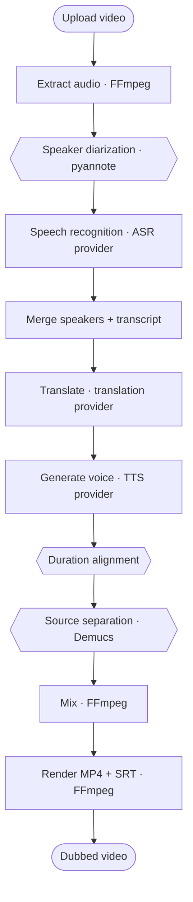

# DubFlow — Multilingual Video Dubbing

DubFlow is a configurable video dubbing pipeline built with FastAPI, n8n, and
FFmpeg. It supports interchangeable providers for speech recognition,
translation, speech generation, speaker diarization, and source separation.
Inference can run locally with Docker or remotely in a Google Colab GPU session.

| | |
|---|---|
| **Stack** | FastAPI · n8n · FFmpeg · Docker Compose · optional Google Colab |
| **Models** | 16 ASR · 3 translation · 2 TTS · 1 diarization · 2 separation |
| **Languages** | 50 (ISO-639-1), coverage declared per model |
| **Tests** | 151, no GPU and no model download required |
| **Status** | Reference implementation for development and demonstrations; see [Limitations](#limitations) |

---

## Contents

- [Overview](#overview)
- [Getting started](#getting-started)
- [Architecture](#architecture)
- [Models](#models)
- [Configuration](#configuration)
- [API reference](#api-reference)
- [Development](#development)
- [Troubleshooting](#troubleshooting)
- [Limitations](#limitations)
- [Future work](#future-work)
- [Licensing and attribution](#licensing-and-attribution)

---

## Overview

Upload a video, choose a target language and a set of models, and receive an
MP4 with a synchronised voice-over and embedded subtitles.



Hexagons represent optional stages. Disabled stages are recorded as skipped,
and the remaining stages continue normally.

### Design principles

- Pipeline stages depend on provider interfaces instead of specific models.
- `GET /capabilities` is the shared model catalogue used by the APIs and web UI.
- Each model declares its supported languages, availability requirements, and
  licence in the provider registry.

---

## Getting started

### Prerequisites

| Requirement | Notes |
|---|---|
| Docker Desktop, running | Supplies n8n, FFmpeg and the optional local model service |
| `python3` ≥ 3.9 on the host | Only for `make check` and the tests |
| One inference option | Local CPU, local NVIDIA GPU, or a Google Colab GPU session |

### Option A: run everything locally

CPU mode works on Docker Desktop, including Apple Silicon:

```bash
make local
```

On Linux or Windows with NVIDIA Container Toolkit and a supported NVIDIA GPU:

```bash
make local-gpu
```

| Service | URL |
|---|---|
| Web UI | <http://localhost:8000> |
| Local AI API | <http://localhost:8001/docs> |
| n8n workflow | <http://localhost:5678> |

The image installs PyTorch, faster-whisper, Transformers and the base model
providers. The first job downloads the selected weights into the
`local-model-cache` Docker volume; later containers reuse them. The default
Whisper small, NLLB-200 600M and MMS-TTS path runs without optional packages.
On CPU, start with a 10-second clip and expect model loading and inference to be
much slower than on a GPU.

Optional packages are not installed in the base local image. Edge TTS,
pyannote, and Demucs remain unavailable until their packages and any required
credentials are added. The base configuration supports a stock MMS voice,
duration alignment, and voice-over mixing.

Multi-voice is a development feature and is off by default. To build the two
optional packages it needs and start the local stack with the feature enabled:

```bash
DUBFLOW_MULTI_VOICE=true HF_TOKEN=hf_your_token make local
```

The flag selects Edge TTS, forces speaker diarization, and keeps one Edge voice
assigned to each speaker label for the duration of the job. Put both values in
`.env` instead if the setting should survive later restarts.

Useful local commands:

```bash
make local-logs          # local-ai + API + n8n
make local-restart       # CPU mode after code/config changes
make local-gpu-restart   # the same while retaining NVIDIA GPU access
make local-stop          # keeps jobs and downloaded model weights
```

### Option B: run inference on Colab

#### 1. Start the AI service on Colab

1. Open [`colab/ai_service.ipynb`](colab/ai_service.ipynb) in Google Colab and
   select a GPU runtime.
2. In the first cell, enable only the engines you intend to use. See
   [Optional model packages](#optional-model-packages). Add a Hugging Face
   token into `HF_TOKEN` if you want speaker diarization.
3. Run all cells. The last one prints a ready-to-run command.

The launch cell stops the previous server and reloads the checkout. If the
session was started by an older notebook version, select **Runtime → Restart
session** before running all cells again.

#### 2. Point the local stack at that session

```bash
make colab URL=https://your-tunnel.trycloudflare.com TOKEN=your-token
```

This writes `.env`, restarts the API and reports which backends are live. The
tunnel URL changes every time the Colab session restarts.

#### 3. Start the stack

```bash
make start
```

| Service | URL |
|---|---|
| Web UI | <http://localhost:8000> |
| API documentation | <http://localhost:8000/docs> |
| n8n workflow | <http://localhost:5678> |

Upload a 10–20 second clip for the first run and monitor the ten pipeline
stages in the web UI.

---

## Architecture

### Layers

The system is organized into three layers:

| Layer | Location | Responsibility |
|---|---|---|
| HTTP API | `colab/server.py`, `ai-service/app.py` | Requests, authentication, files |
| Pipeline | `colab/pipeline/` | Stage order and job state |
| Providers | `colab/providers/<task>/` | One model family each |

- `dubflow_core/` contains dependency-free contracts shared by both services:
  languages, segments, alignment calculations, and FFmpeg filter graphs.
- `colab/providers/<task>/registry.py` contains model metadata and can be loaded
  without importing model libraries.
- Provider implementations are imported only when their models are requested.

### Repository layout

```text
dubflow_core/            Shared, dependency-free: languages, segments,
                         alignment, mixing
colab/                   AI service (runs on the Colab GPU)
  ai_service.ipynb       Notebook: install flags, launch, tunnel
  server.py              HTTP layer only
  jobs.py                Job store and single-worker queue
  core/                  Errors, runtime (device, model slots), media, config
  providers/
    base.py              ModelSpec and Registry
    asr/                 faster_whisper, seamless, mms
    translation/         nllb, seamless
    tts/                 mms, edge
    diarization/         pyannote
    separation/          demucs
  pipeline/              The ten stages and the runner
ai-service/              Local FastAPI service: storage, FFmpeg, orchestration
local-ai-service/        Docker image for running the Colab API locally
frontend/index.html      Single-file web UI, reads /capabilities
n8n/workflows/           The visual pipeline
scripts/                 check_contract.py, set_backend.py
tests/                   151 tests, no GPU required
```

### Pipeline stages

On the n8n route the FFmpeg stages run in `ai-service`. Model calls go to the
selected AI backend over HTTP. With `make local` that traffic stays inside the
Docker network; with a notebook backend it crosses the tunnel. The AI backend's
own `POST /jobs` can also run all ten stages itself.

| # | Stage | Runs on | Optional | Produces |
|---|---|---|---|---|
| 1 | `extract` | Local FFmpeg | | 48 kHz soundtrack + 16 kHz mono for the models |
| 2 | `diarize` | AI service | ● | Speaker turns |
| 3 | `transcribe` | AI service | | Canonical segments |
| 4 | `merge_segments` | Local | | A speaker per segment, by time overlap |
| 5 | `translate` | AI service | | Translations and the SRT (skipped when source = target) |
| 6 | `synthesize` | AI service | | One WAV per segment |
| 7 | `align` | Local FFmpeg | ● | Each line fitted to its time window |
| 8 | `separate` | AI service | ● | Background stem without the original speech |
| 9 | `mix` | Local FFmpeg | | Dub track placed at timestamps, blended |
| 10 | `render` | Local FFmpeg | | MP4 with audio and embedded subtitles |

### Long stages do not hold a connection open

Long model stages can exceed the request limit of a Cloudflare quick tunnel.
The four slow endpoints therefore support `async_mode`. The backend returns
`202` with a task ID, and the local service polls `GET /tasks/{id}` until the
task completes.

| Endpoint | Async request | Response |
|---|---|---|
| `POST /diarize`, `/transcribe`, `/separate` | Form field `async_mode=true` | `202` with `task_id` |
| `POST /translate` | JSON field `"async_mode": true` | `202` with `task_id` |
| `GET /tasks/{id}` | Poll by task ID | Status and result when complete |
| `GET /tasks/{id}/download` | Download by task ID | File produced by `/separate` |

- Async processing is opt-in; requests without `async_mode` remain synchronous.
- Older backends that return a direct `200` response remain compatible.
- Failed tasks preserve the original HTTP status code and error message.

Validation still happens inside the request, so an impossible configuration is
refused immediately instead of becoming a task that fails later.

### Model catalogue

`GET /capabilities` exposes the model catalogue. The local API proxies it, the
web UI renders it, and [`scripts/check_contract.py`](scripts/check_contract.py)
checks that the UI, local API, n8n workflow, and registry remain consistent.

The n8n form is static and cannot query backend availability. It collects the
video, languages, and voice, while the AI service applies defaults for the
remaining settings. The web UI reads `/capabilities` and disables unavailable
models.

---

## Models

The tables below reflect the metadata declared in the provider registry and
returned by `/capabilities`.

### Speech recognition

| Model | Provider | Languages | Timestamps | Detects language | Licence | Install |
|---|---|---|---|---|---|---|
| `tiny` … `large-v3-turbo` (7 multilingual) | faster_whisper | all 50 | ✓ | ✓ | MIT | base |
| `tiny.en` … `medium.en`, `distil-*` (7 English-only) | faster_whisper | English | ✓ | — | MIT | base |
| `seamless_asr` | seamless | 48 (no Malay, Sinhala) | windowed | — | CC-BY-NC-4.0 | base |
| `mms_asr` | mms | 49 (no Sinhala) | windowed | — | CC-BY-NC-4.0 | base |

For recognisers without timestamps, the pipeline creates audio windows from
diarization turns or voice-activity detection and converts the result to the
canonical segment format.

### Translation

| Model | Languages | Licence | Install |
|---|---|---|---|
| `nllb` (600M, default) | all 50 | CC-BY-NC-4.0 | base |
| `nllb_1.3b` | all 50 | CC-BY-NC-4.0 | base |
| `seamless` | 49 (no Sinhala) | CC-BY-NC-4.0 | base |

### Speech generation

| Model | Languages | Licence | Install |
|---|---|---|---|
| `mms` | 34 | CC-BY-NC-4.0 | base |
| `edge` | 49 (no Armenian) | Microsoft service terms | `edge-tts` |

Both providers use stock voices. Voice cloning is not currently supported; see
[Future work](#future-work).

`mms` covers 34 of the 50 application languages. No MMS-TTS checkpoint is
registered for Japanese, Chinese, Italian, Czech, Danish, Norwegian, Urdu,
Croatian, Serbian, Slovak, Slovenian, Armenian, Georgian, Nepali, Sinhala or
Mongolian. Unsupported combinations are rejected during job validation.

### Diarization and separation

| Task | Model | Licence | Install |
|---|---|---|---|
| Diarization | `pyannote_3_1` | MIT, gated weights | `pyannote.audio` + `HF_TOKEN` |
| Separation | `htdemucs`, `htdemucs_ft` | MIT | `demucs` |

---

## Configuration

### Optional model packages

The base install covers Whisper, SeamlessM4T and MMS recognition, both
translation engines and the `mms` voice. Three flags in the notebook's first
cell add the rest of what this build registers:

```python
MULTI_VOICE = False          # development feature; set True before starting the API
INSTALL_EDGE = True          # edge           - stock voice, 49 languages, no GPU
INSTALL_DIARIZATION = True   # pyannote.audio - one voice per speaker
INSTALL_DEMUCS = True        # demucs         - separate speech from background
```

`MULTI_VOICE = True` requires both `INSTALL_EDGE` and
`INSTALL_DIARIZATION`. It makes Edge the default voice provider and prevents a
multi-voice job from running with a single-voice provider such as MMS.

When a package is disabled, `/capabilities` reports its models as unavailable,
the web UI disables them, and incompatible jobs are rejected during validation.

`INSTALL_DIARIZATION` needs `HF_TOKEN`, and the account behind it has to have
accepted the conditions on both `pyannote/speaker-diarization-3.1` and
`pyannote/segmentation-3.0`.

The notebook runs a dependency preflight after installing optional packages and
reports incompatible imports before starting the API.

### Environment variables — local stack

Set in `.env`; `docker-compose.yml` passes them through.

| Variable | Default | Purpose |
|---|---|---|
| `AI_BACKENDS` | `colab,kaggle` | AI backends to try, most preferred first |
| `COLAB_API_URL` | — | Tunnel URL printed by the notebook |
| `COLAB_API_TOKEN` | — | Bearer token printed by the notebook |
| `KAGGLE_API_URL` / `KAGGLE_API_TOKEN` | — | Second backend slot |
| `LOCAL_API_URL` / `LOCAL_API_TOKEN` | — | Local model service; set by the local Compose overlay |
| `LOCAL_AI_PORT` | `8001` | Host-only port for the local model API |
| `DUBFLOW_MULTI_VOICE` | `false` | Enable the development multi-voice path; local builds then install Edge and pyannote |
| `COLAB_API_TIMEOUT` | `1800` | Seconds allowed per backend call |
| `ASYNC_STAGES` | `1` | Run the slow stages as notebook tasks and poll, instead of holding one long request open |
| `TASK_POLL_INTERVAL` | `3` | Seconds between polls |
| `TASK_POLL_TIMEOUT` | `3600` | Seconds to keep polling before giving up on a task |
| `STALLED_AFTER` | `1200` | Seconds before a running job is reported as stalled |
| `BACKEND_PROBE_TTL` | `30` | Seconds a successful `/health` probe is cached |
| `BACKEND_PROBE_TIMEOUT` | `10` | Seconds to wait for `/health` |
| `CAPABILITIES_TTL` | `60` | Seconds the model catalogue is cached |
| `DATA_ROOT` | `/data/jobs` | Job storage inside the container |
| `PUBLIC_BASE_URL` | `http://localhost:8000` | Used to build download URLs |
| `N8N_WEBHOOK_URL` | `http://n8n:5678/webhook/dubbing/start` | Where `POST /jobs/{id}/start` sends the job |

Each backend name `NAME` in `AI_BACKENDS` reads `NAME_API_URL` and
`NAME_API_TOKEN`, so the same routing works for local, Colab and Kaggle.
Before each call the service probes `/health` in order and uses the first that
answers. The local Compose overlay sets `AI_BACKENDS=local` and starts that
service. A notebook session still requires a human to start it; `make backends`
reports whichever configured backend is alive.

### Environment variables — AI service

Set in the notebook before the launch cell.

| Variable | Default | Purpose |
|---|---|---|
| `AUTH_TOKEN` | generated per session | Bearer token; empty disables authentication |
| `WHISPER_MODEL` | `small` | Model used when a request names none |
| `HF_TOKEN` | — | Hugging Face token for gated weights. `HUGGINGFACE_TOKEN` and `HUGGING_FACE_HUB_TOKEN` are also read |
| `JOBS_ROOT` | `/content/dubflow-jobs` | Where end-to-end jobs are stored |
| `JOBS_LIMIT` | `20` | Job folders kept before the oldest are deleted |
| `DUBFLOW_DEVICE` | auto-detected | Force `cuda` or `cpu` |
| `DUBFLOW_KEEP_MODELS` | unset | Keep models resident between stages; see [Memory management](#memory-management) |
| `DUBFLOW_MULTI_VOICE` | `false` | Force diarization and use a stable Edge voice per speaker label |
| `TRANSLATION_MODEL` | `facebook/nllb-200-distilled-600M` | Override the default NLLB checkpoint |
| `SEAMLESS_MODEL` | `facebook/hf-seamless-m4t-medium` | Override the SeamlessM4T checkpoint |

### Memory management

Models load on demand. Each task type has one model slot; loading another model
in the same slot releases the current model, runs garbage collection, and
clears the CUDA cache. `GET /health` reports resident models, and `POST /unload`
releases them.

For `POST /jobs`, a slot is released after its final stage. Set
`DUBFLOW_KEEP_MODELS=1` to retain models between jobs when sufficient memory is
available.

The n8n workflow calls `/transcribe`, `/translate`, and `/synthesize` as
independent requests, so those models can remain resident. Call `POST /unload`
between runs when GPU memory is limited.

---

## API reference

Both services expose OpenAPI documentation at `/docs`.

### AI service (Colab)

All routes take `Authorization: Bearer $COLAB_API_TOKEN` when `AUTH_TOKEN` is
set. `GET /health` stays open so the local service can probe it.

| Method | Path | Purpose |
|---|---|---|
| `GET` | `/capabilities` | The model catalogue and what this session can run |
| `GET` | `/health` | Liveness, device, resident models |
| `GET` | `/languages` | The 50 application languages |
| `POST` | `/validate` | Check a job configuration without creating one |
| `POST` | `/jobs` | Dub a video end to end (returns immediately) |
| `GET` | `/jobs`, `/jobs/{id}` | List, or one job's status and configuration |
| `GET` | `/jobs/{id}/segments` | Canonical segments and speaker turns |
| `GET` | `/jobs/{id}/download`, `/jobs/{id}/subtitle` | The rendered MP4 and the SRT |
| `DELETE` | `/jobs/{id}` | Remove a job and its files |
| `POST` | `/unload` | Release every resident model |

Stage endpoints can also be called independently:

| Method | Path | In → out |
|---|---|---|
| `POST` | `/diarize` | audio → speaker turns |
| `POST` | `/transcribe` | audio [+ turns] → canonical segments |
| `POST` | `/translate` | texts → translations |
| `POST` | `/synthesize` | text → WAV |
| `POST` | `/align` | segments → per-segment speed plan |
| `POST` | `/separate` | audio → one stem |

```bash
# What can this session actually run?
curl "$COLAB_API_URL/capabilities" -H "Authorization: Bearer $COLAB_API_TOKEN"

# Check a configuration without creating a job.
curl -X POST "$COLAB_API_URL/validate" -H "Authorization: Bearer $COLAB_API_TOKEN" \
     -H 'Content-Type: application/json' \
     -d '{"target_language":"ja","tts_model":"mms"}'
# 400: 'MMS-TTS' (mms) does not support target language 'ja'. ...

# Dub a video end to end.
curl -X POST "$COLAB_API_URL/jobs" -H "Authorization: Bearer $COLAB_API_TOKEN" \
     -F video=@clip.mp4 \
     -F target_language=vi \
     -F asr_provider=faster_whisper -F asr_model=large-v3-turbo \
     -F translation_provider=nllb \
     -F tts_provider=edge -F tts_model=edge \
     -F enable_diarization=true \
     -F enable_alignment=true

curl "$COLAB_API_URL/jobs/<job_id>"           # status, config, alignment summary
curl -OJ "$COLAB_API_URL/jobs/<job_id>/download"
```

### Local service

| Method | Path | Purpose |
|---|---|---|
| `GET` | `/` | The web UI |
| `GET` | `/capabilities` | The backend's catalogue, or why it is unavailable |
| `GET` | `/health`, `/backends`, `/languages` | Status and configuration |
| `POST` | `/jobs/upload` | Store a video and settle its configuration |
| `POST` | `/jobs/{id}/start` | Hand the job to n8n, or resume a failed job |
| `POST` | `/stages/{stage}` | Run one stage; the ten names are in the table above |
| `GET` | `/jobs/{id}` | The full job manifest |
| `GET` | `/jobs/{id}/download`, `/jobs/{id}/subtitle` | Results |

### Resuming a failed job

Each stage stores its result in `job.json` or the job directory before the next
stage starts. Completed stages return `reused` instead of running again:

```json
{"stage": "extract", "status": "completed", "reused": true,
 "reason": "this stage already produced its output"}
```

Calling `POST /jobs/{id}/start` for a failed job clears the failure and restarts
the workflow from the failed stage:

```json
{"status": "accepted", "resumed_from": "translate",
 "reusing": ["upload", "extract", "transcribe", "merge_segments"]}
```

Selecting a job in the web UI restores its requested languages, models, and
feature flags. Failed jobs expose a **Retry from "…"** action. Jobs originally
configured for automatic language detection remain in automatic mode.

Pass `{"job_id": "…", "force": true}` to run a completed stage again.

### Canonical segment

Every stage reads and writes the same record, so a skipped stage never leaves
the next one guessing.

```json
{
  "id": 0,
  "speaker_id": "SPEAKER_00",
  "start": 1.23, "end": 4.85, "duration": 3.62,
  "source_text": "Hello everyone",
  "translated_text": "Xin chào mọi người",
  "tts_file": "tts/0000.wav",
  "source_duration": 3.62, "tts_duration_raw": 4.4,
  "alignment_speed": 1.25, "tts_duration_final": 3.52,
  "alignment_status": "aligned"
}
```

`alignment_status` is one of `fits`, `aligned`, `clamped` (the speed limit was
reached and the line still overruns), `stretched` or `unmeasured`. The limits
are `min_speed` and `max_speed` per request, defaulting to 0.75 and 1.35.

Speaker labels are diarization labels: `SPEAKER_00` is a cluster, not a person.

### Legacy API compatibility

Legacy parameter aliases remain supported. Voice-cloning options and endpoints
were removed with the F5 providers.

| Previous | Current | Notes |
|---|---|---|
| `model=large-v3` | `asr_model=large-v3` | `model` still accepted |
| `translation_engine=nllb` | `translation_model=nllb` | Still accepted |
| `tts_engine=mms` | `tts_model=mms` | Still accepted |
| `GET /health` → `whisper_models`, `tts_engines` | `GET /capabilities` | The old keys are still published |
| Six-stage progress | Ten stages, optional ones skip | `progress` counts planned stages only |

Current behavior differs from the original pipeline in three areas:

- Alignment is enabled by default. Generated speech is fitted to its original
  time window.
- Language support is validated when a job is created. Unsupported combinations,
  such as `mms` with Japanese, are rejected before processing begins.
- Voice cloning is not available. `enable_voice_cloning` is ignored, and the
  `voice_references` stage is no longer part of the pipeline.

---

## Development

### Tests

```bash
make test    # python3 -m pytest tests -q
make check   # tests + syntax + JSON + contract + compose validation
```

The suite needs no GPU, no model download and no torch. The registry, the API,
the configuration rules and both implementations of the pipeline are exercised
with stand-in models and real FFmpeg.

### Contract check

`scripts/check_contract.py` verifies that the frontend, local API, n8n form, and
provider registry use the same models and pipeline stages.

### Make targets

| Target | Effect |
|---|---|
| `make start` | Build, start, import and activate the workflow |
| `make local` | Run the complete stack with local CPU inference |
| `make local-gpu` | Run the complete stack with NVIDIA GPU inference |
| `make local-logs` / `make local-stop` | Follow local logs, or stop while retaining caches |
| `make colab URL=… TOKEN=…` | Point the stack at a Colab session |
| `make kaggle URL=… TOKEN=…` | The same for the second backend slot |
| `make backends` | Which notebook sessions are alive |
| `make restart` | Apply `.env` or `app.py` changes |
| `make import` | Re-import and re-activate the workflow after editing its JSON |
| `make logs` / `make status` | Follow logs, show service status |
| `make test` / `make check` | Test suite, offline checks |
| `make stop` | Stop containers, keep jobs and n8n data |

`frontend/index.html`, `ai-service/app.py` and `dubflow_core/` are bind-mounted.
Frontend edits appear on refresh; Python edits need `make restart`. Only
dependency changes require a rebuild.

---

## Troubleshooting

| Symptom | Cause | Fix |
|---|---|---|
| UI shows **Backend out of date** | The Colab session is running an older build | In Colab, select **Runtime → Restart session**, run all cells, then run `make colab URL=… TOKEN=…` locally |
| UI shows **No AI backend** | The tunnel URL changed or the session stopped | `make backends`, then re-point with `make colab` |
| Local UI shows **No AI backend** | The `local-ai` container is stopped or unhealthy | `make local-restart`, then inspect `make local-logs` |
| Local first request is slow | The selected model is downloading and loading | Watch `make local-logs`; the named cache volume preserves the download |
| Local CPU appears stuck | Model inference is substantially slower without a GPU | Use a short clip and the default small models, or use `make local-gpu` |
| `make start` reports auto-activation unavailable | The n8n CLI refused to activate | Open <http://localhost:5678>, open *Multilingual Dubbing*, save it, set it Active |
| Upload rejected: *does not support target language* | The chosen engine has no such language | Pick another model; the error names working alternatives |
| Upload rejected: *cannot detect the spoken language* | The recogniser has no language identification | Set **Original language** explicitly instead of Detect automatically |
| `503` *needs the '…' package* | The engine's flag is off in the notebook | Enable it in cell 1, re-run the install cell, then re-run the launch cell |
| `503` *HF_TOKEN is not set* | pyannote's weights are gated | Accept the conditions on both pyannote model pages, paste a token into cell 1 |
| Colab reports incompatible imports | An optional package replaced a pinned dependency | Disable the most recently enabled optional package, restart the runtime, and run all cells again |
| CUDA out of memory on the n8n route | Three models resident at once | `POST /unload`, or choose a smaller checkpoint |

---

## Limitations

- With a notebook backend, source separation sends the full soundtrack through
  the tunnel and downloads a stem. Local mode keeps that transfer inside Docker.
- Segments are never split at a speaker change. An utterance where two people
  overlap is credited to whichever speaker holds most of it, recorded in
  `speaker_confidence`.
- Colab storage is ephemeral. A dropped session loses queued and running jobs, so
  download results promptly.
- The local services have no authentication. `ai-service` publishes port 8000
  and n8n publishes 5678, both unauthenticated. This is a demo stack; do not
  expose it to a network you do not control.
- The n8n workflow has no retry or failure branch: a dropped tunnel stops the
  run. The web UI still reports the failing stage and its message.
- With multi-voice disabled, speaker diarization does not change the generated
  voice. With it enabled, speakers outnumbering the available Edge voices reuse
  voices deterministically.

---

## Development features

### Per-speaker voices

Set `DUBFLOW_MULTI_VOICE=true` locally, or `MULTI_VOICE = True` in the notebook,
to map pyannote labels to Edge voices. The mapping is deterministic: the same
speaker label keeps the same voice, and `job.json` records it under
`speaker_voice_map`. This uses stock voices and does not clone the original
speakers. F5-TTS support remains removed because its dependencies are
incompatible with the base Colab environment.

### Lip sync

Lip synchronization is not part of the current pipeline. Adding it would
require:

1. A `lipsync` registry under `colab/providers/`, shaped like `separation/`.
2. A `pipeline/lipsync.py` stage with an `enabled(job)`, inserted between `mix`
   and `render`, plus its slot in `STAGE_SLOTS`.
3. A `lip_sync` flag on `Features`, and `render` reading the lip-synced video.

For a remote notebook backend, the design must also account for transferring
the video to and from the lip-sync stage.

---

## Licensing and attribution

This repository does not yet carry a licence file. Add one before publishing;
until then, no licence is granted for the project's own source.

Model weights retain their own licences. The registry records these licences and
returns them through `/capabilities`:

| Licence | Models | Implication |
|---|---|---|
| MIT | Whisper, pyannote, Demucs | Commercial use permitted, subject to each licence |
| CC-BY-NC-4.0 | NLLB-200, SeamlessM4T, MMS (ASR and TTS) | Non-commercial use only |
| Service terms | Edge TTS | Sends text to a Microsoft endpoint; do not use for confidential material |

All translation models currently registered by this project use CC-BY-NC-4.0.
Generated dubs are therefore limited to non-commercial use regardless of the
selected voice.

Built on [faster-whisper](https://github.com/SYSTRAN/faster-whisper),
[NLLB-200](https://huggingface.co/facebook/nllb-200-distilled-600M),
[SeamlessM4T](https://huggingface.co/facebook/seamless-m4t-v2-large),
[MMS](https://huggingface.co/facebook/mms-1b-all),
[pyannote.audio](https://github.com/pyannote/pyannote-audio),
[Demucs](https://github.com/adefossez/demucs),
[n8n](https://n8n.io) and [FFmpeg](https://ffmpeg.org).
